# Asymptotic & Finite‑Sample Analysis of Monte Carlo VaR/ES under Heavy‑Tailed Returns

A fully reproducible research framework for studying **Value‑at‑Risk (VaR)** and **Expected Shortfall (ES/CVaR)** estimation under:

-   Heavy-tailed returns
-   Finite-sample uncertainty
-   Model misspecification
-   Time-varying volatility

This project integrates statistical theory, Monte Carlo simulation, variance reduction, backtesting diagnostics, proper scoring rules, and GARCH volatility modeling into a coherent experimental pipeline.

---
## Overview

We study extreme-tail risk estimation at high confidence levels (e.g. \alpha
= 0.99) using:

- **Large‑sample theory** (quantile CLT / weak convergence)
- **Finite‑sample concentration** (Dvoretzky–Kiefer–Wolfowitz (DKW) inequality)
- **Monte Carlo methods**  (Gaussian parametric,Heavy-tailed Student-t)
- **variance reduction** (antithetic variates, importance sampling)
- **Model risk / misspecification** (Gaussian vs Student‑t)
- **Time‑varying volatility** via **GARCH(1,1)**
- **Backtesting** (Kupiec UC, Christoffersen independence) + **proper scoring** (Fissler–Ziegel / FZ0)

---

## Quick start

### Option A — Conda (recommended)

```bash
conda env create -f environment.yml
conda activate montecarlo-var
```

### Option B — pip

```bash
pip install -r requirements.txt
```

---

## Reproduce the results

### 1) Download prices and build returns

```bash
python -m scripts.get_data
```

This writes:
- `data/prices.csv`
- `data/returns.csv`

### 2) Run all experiments from YAML configs

```bash
python -m scripts.run_all_experiments
```

Outputs are written to:
- `paper/tables/*.csv`
- `paper/figures/*.png`

### 3) Generate plots + overview

Open the notebook:

- `notebooks/02_experiments_overview.ipynb`

---

## What is implemented

### Risk measures

Let portfolio return be \(R\) and **loss** be \(L = -R\).

- **VaR at level \(\alpha\)**:
\[
\mathrm{VaR}_\alpha(L) = q_\alpha(L)
\]
(the \(\alpha\)-quantile of loss)

- **Expected Shortfall (ES)**:
\[
\mathrm{ES}_\alpha(L)=\mathbb{E}[L\mid L\ge \mathrm{VaR}_\alpha(L)]
\]

Empirical estimators are computed from simulated losses.

---

## Experiments (what to look at)

### exp01 — Classical Monte Carlo (Gaussian) vs historical bootstrap

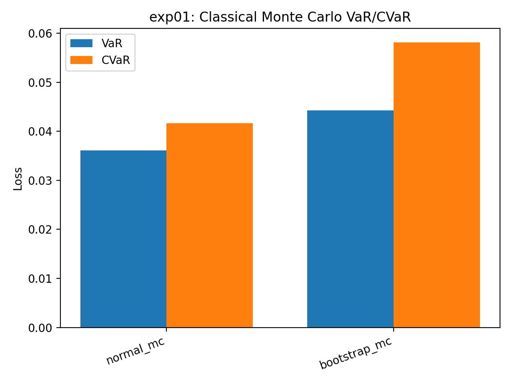

### exp02 — Heavy tails: multivariate Student‑t extension

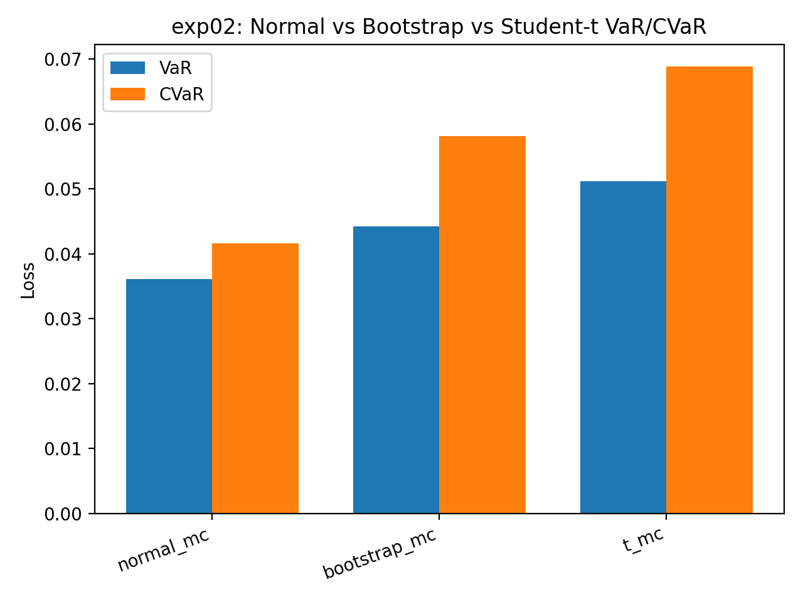

### exp03 — Quantile asymptotics: CLT + plug‑in density \(\hat f(q_\alpha)\)

Quantile CLT (heuristic form):
\[
\sqrt{n}(\hat q_\alpha - q_\alpha) \Rightarrow \mathcal{N}\left(0,\frac{\alpha(1-\alpha)}{f(q_\alpha)^2}\right)
\]

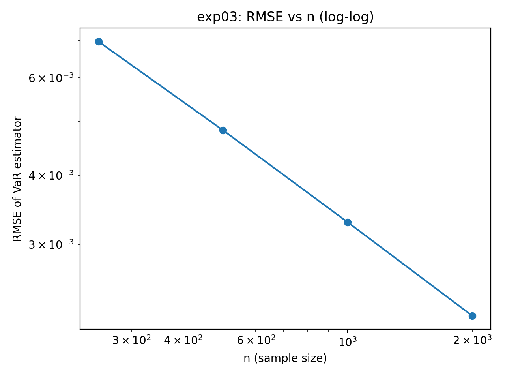
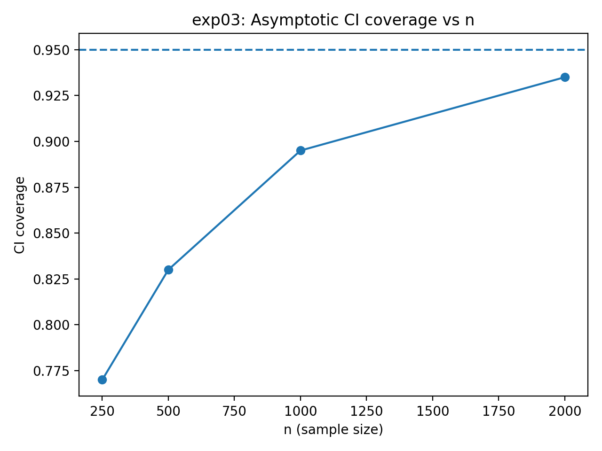
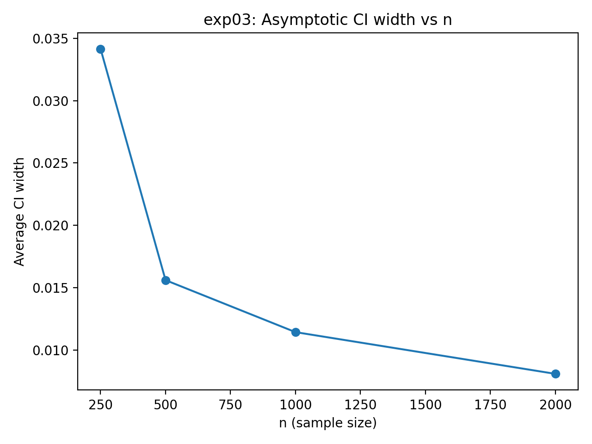

### exp04 — Finite‑sample concentration: DKW quantile brackets

DKW inequality:
\[
\Pr\left(\sup_x |F_n(x)-F(x)|>\varepsilon\right) \le 2e^{-2n\varepsilon^2}
\]


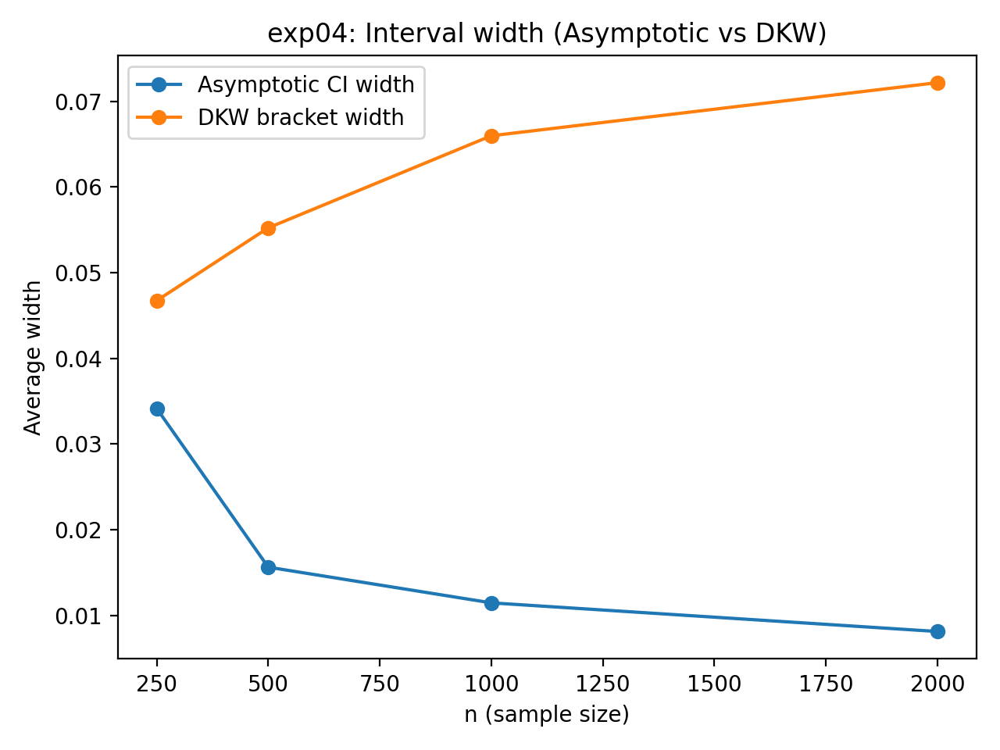

### exp05 — Variance reduction: antithetic variates (VaR/ES may be non‑smooth)


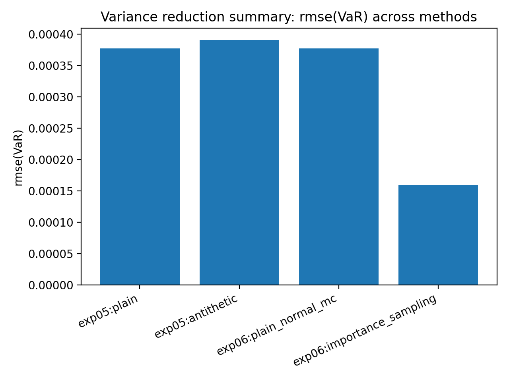

### exp06 — Importance sampling (Gaussian mean‑shift) for tail estimation

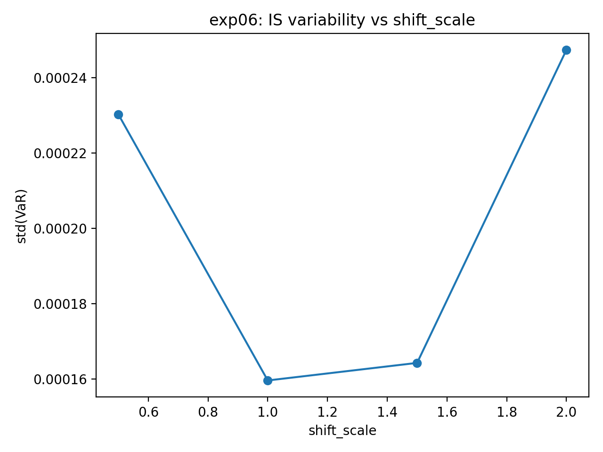


### exp07 — Model misspecification: synthetic Student‑t truth vs Gaussian forecasting

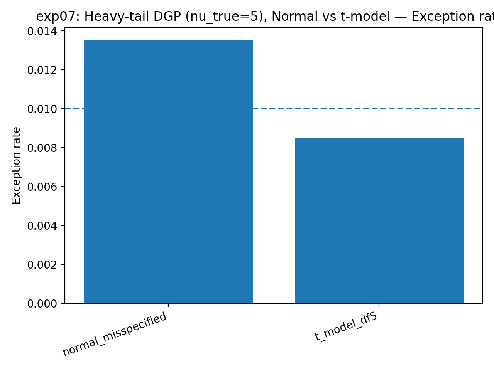

### exp08 — ES backtesting under real returns (normal vs historical)

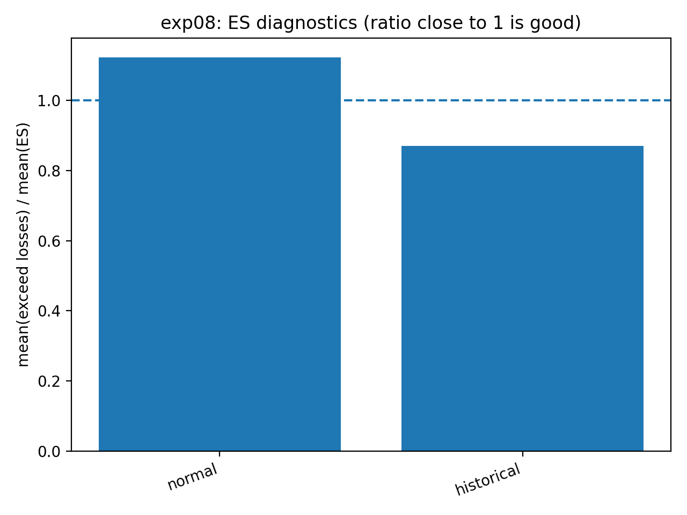

### exp09 — Time‑varying volatility: GARCH(1,1)‑Normal VaR/ES

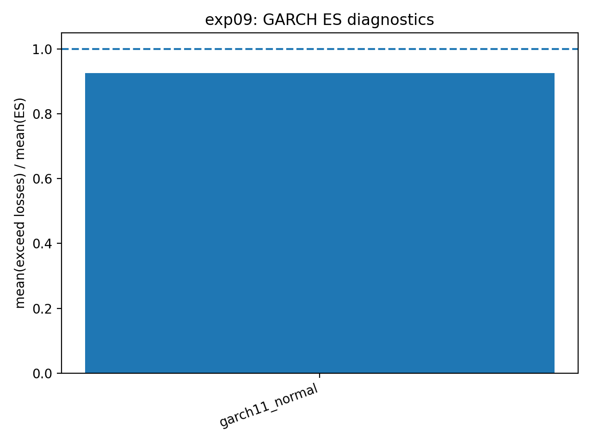

### exp10 — GARCH(1,1)‑Student‑t VaR/ES + tail thickness tracking

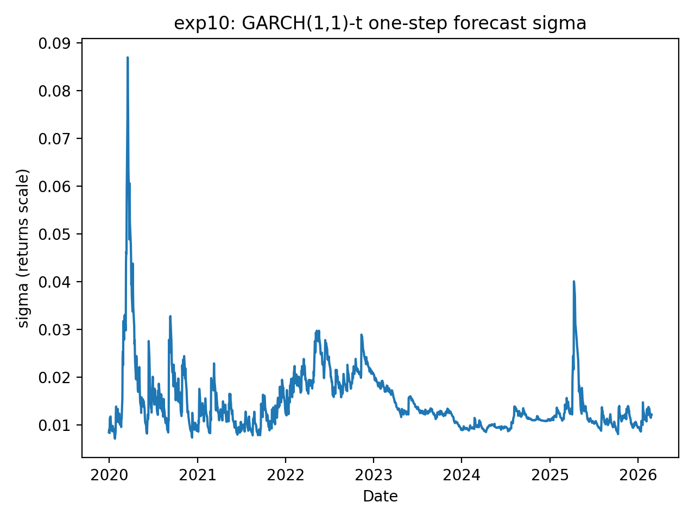
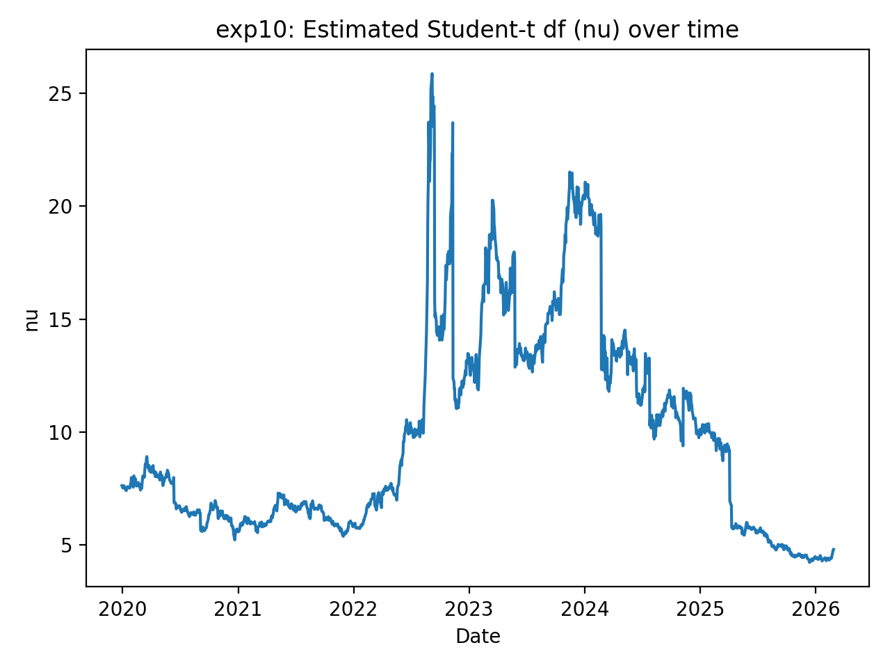

---

## Main results snapshot (VaR/ES backtests)

Interpretation:
- `exception_rate` should be close to \(1-\alpha\)
- `kupiec_p_uc` tests unconditional coverage (UC)
- `christoffersen_p_ind` tests independence (clustering)
- `es_ratio = mean_exceed_loss / mean_es` (near 1 is good)
- `fz0_mean` is a proper joint VaR–ES score (lower is better)

| model          |   alpha |   window |   exception_rate |   kupiec_p_uc |   christoffersen_p_ind |   es_ratio |   fz0_mean |    n |   n_exceed |
|:---------------|--------:|---------:|-----------------:|--------------:|-----------------------:|-----------:|-----------:|-----:|-----------:|
| normal         |    0.99 |      500 |       0.021978   |   4.34995e-05 |              0.0417073 |   1.12225  |   -3.20957 | 1547 |         34 |
| historical     |    0.99 |      500 |       0.0168067  |   0.0142198   |              0.0083077 |   0.870115 |   -2.94279 | 1547 |         26 |
| garch11_normal |    0.99 |      500 |       0.0226244  |   1.84661e-05 |              0.240866  |   0.925417 |   -3.39014 | 1547 |         35 |
| garch11_t      |    0.99 |      500 |       0.00904977 |   0.702639    |              0.612966  |   0.75895  |   -3.07765 | 1547 |         14 |

### Proper scoring (FZ0) model ranking

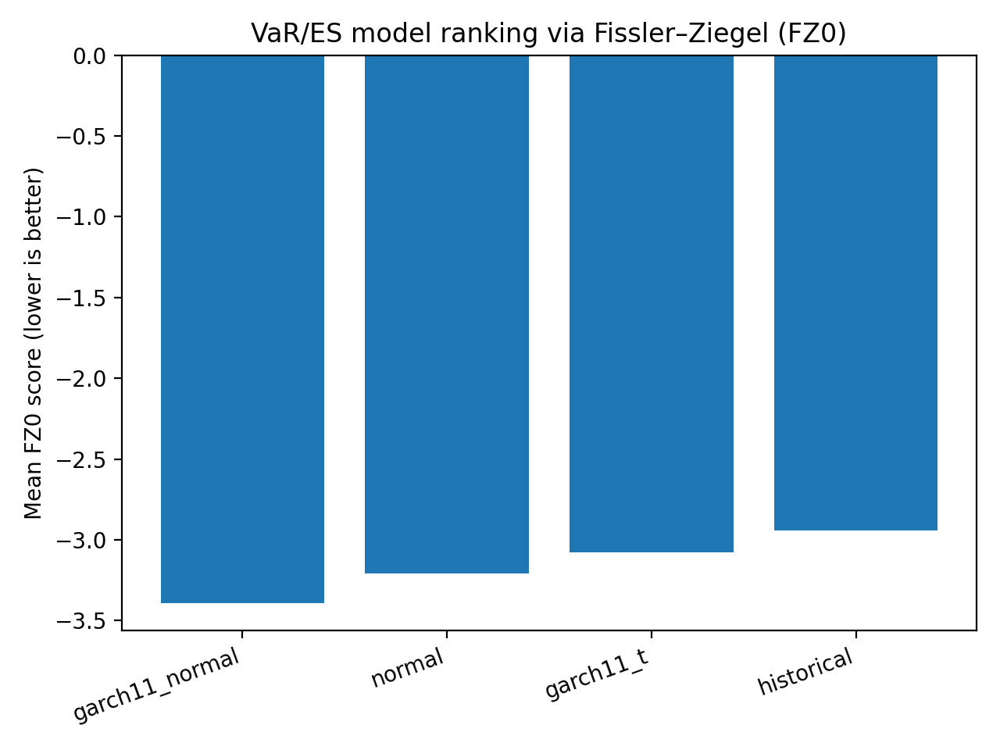

---

## Repository layout

- `src/` — core methods (simulation, theory, bounds, backtests, GARCH)
- `experiments/` — YAML experiment definitions
- `scripts/` — data download + full experiment runner
- `paper/` — generated figures/tables suitable for a write‑up
- `notebooks/` — experiment overview / visualization

---

## Notes on data

The download script uses `yfinance` for convenience. Results may vary slightly due to:
- changing data availability
- floating point + randomness (controlled by seeds in experiments)

---

